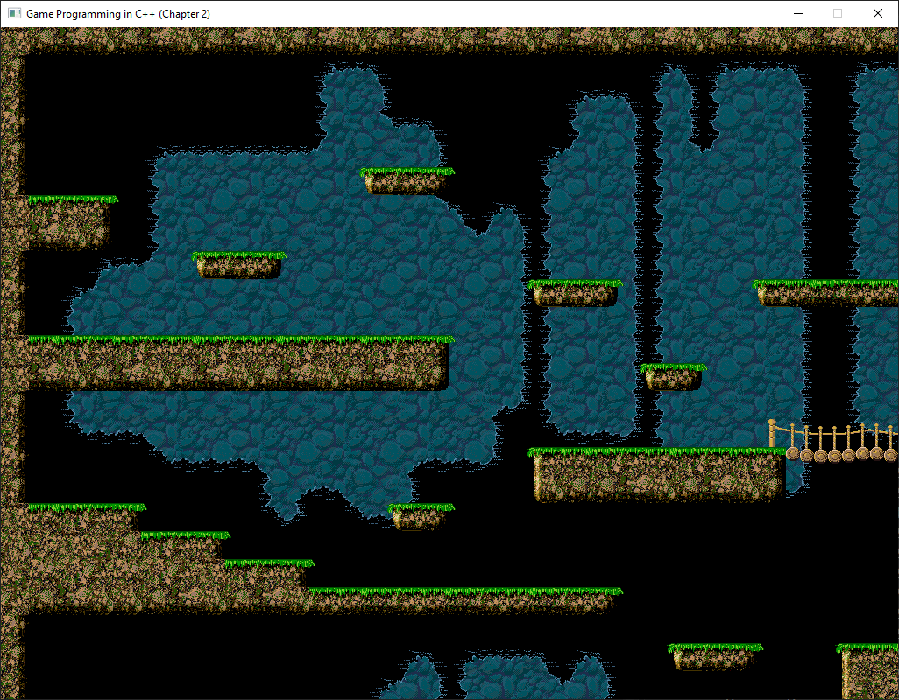

# Game Programming with C++

Studies + exercises from book of the same name by Sanjay Madhav 

## Description

A long-term project that I am using to strengthen and reinforce my game programming fundamentals.
This project starts with fundamental concepts of game programming in 2D and moves into 3D.
Demo projects are written to demonstrate the fundamentals learned.

## Progression

Pong - Core real-time game concepts 

<ul>
<li> Game Loop </li>
<li> Game Updating over time </li>
<li> Game input and output </li>
</ul>

Side Scroller - Game object representation + 2D grahics techniques

<ul>
<li>Game objects representation models</li>
<li>Sprites</li>
<li>Sprite animations</li>
<li>Scrolling backgrounds</li>
<li>Tilemaps</li>
</ul>

Asteroids - Vectors and Basic Physics

<ul>
<li> Vector math: Vectors and how they are used in games</li>
<li>Basics of Newtonian physics</li>
<li>Basic movement - Move Component</li>
<li>Keyboard input - Input Component</li>
<li>Collision detection-Circle Component</li>
</ul>

Asteroids - Convert previous demo from SDL graphics to OpenGL

<li>Begin transition from 2D to 3D</li>
<li>Drawing sprites - triangles(polygons) and vertex array objects</li>
<li>Matrices and transformations: scale - rotation - translation</li>
<li>Object space - World space - Clip space</li>
<li>Vertex and Fragment Shaders</li>
<li>Texture mapping and alpha blending</li>
</ul>

### Dependencies

* Windows 10
* Visual Studio 2022
* SDL
* SDL_image (Demos 1-3)
* OpenGL 3.3 
* GLEW
* SOIL
